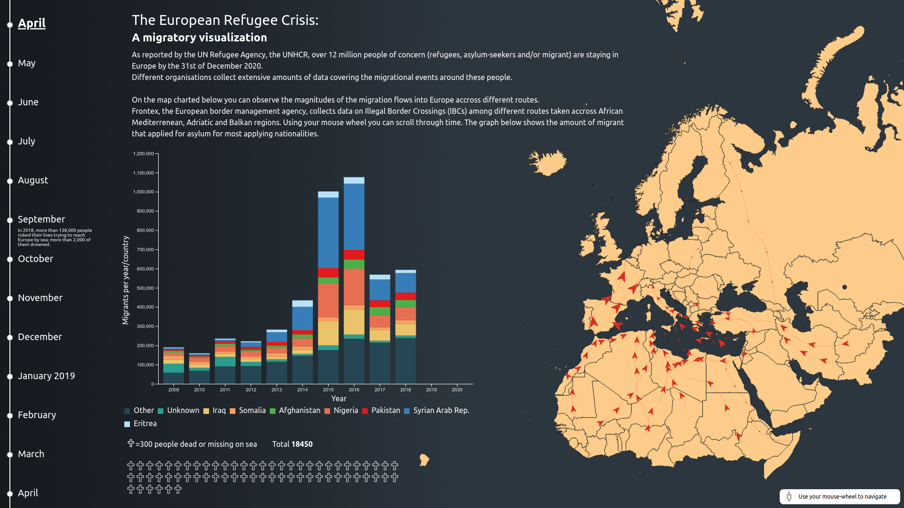

# The European Refugee Crisis Visualized

[Project Website](https://emilelampe.github.io/european-refugee-crisis-visualization/)

By [Emile Lampe](https://emilelampe.github.io), [Quinten van Eijs,](https://github.com/quintene) [Lucas Veeger](https://github.com/LucasVeeger)

This project is a visual representation of the European Refugee Crisis, showing migration into Europe from 2009 to 2020. It is an interactive website created as part of the IN4089 Data Visualization course at TU Delft, awarded with 9/10. Our goal is to provide a more insightful understanding of the crisis, beyond the overwhelming numbers and statistics often seen in news reports. By doing so, we aim to emphasize the human aspect behind the crisis and make the scale of the crisis more comprehensible.

## Project Overview

The website consists of a single page, with a timeline on the left side allowing users to scroll through time from January 2009 to December 2020. The main visual components of the page are:

1. A large map of Europe and Africa on the right, displaying the refugee routes as moving arrows. The size of the arrows changes according to the frequency of use during the respective months.
2. A stacked bar chart in the middle, representing the number of refugees each year and their country of origin.
3. Crosses at the bottom of the page, each representing 300 people who died or went missing trying to cross the Mediterranean Sea.

An explanation of the European Refugee Crisis is provided at the top center of the page.

## Technical Implementation

The website was built using HTML, CSS, and JavaScript, creating an interactive and responsive user interface. We used D3.js, a library for generating data-driven documents and visualizations, to manage the underlying data and create the visual components. The map data was provided in GeoJSON. The use of D3.js enabled us to create visually engaging, dynamic visualizations.

## Data Sources

We used a variety of data sources to represent the European Refugee Crisis, with the primary source being the UNHCR database. Our visualization focuses on countries belonging to Africa and the Middle-East. The time period covered ranges from 2009 to 2020, which allows us to capture the increase in migration before and during the crisis.

The following sources have been instrumental in providing data and inspiration for this project:

- [USA for UNHCR](https://www.unrefugees.org/emergencies/refugee-crisis-in-europe/) - Refugee crisis in Europe: Aid, statistics, and news.
- [Fakhoury, 2016](https://doi.org/10.1080/03932729.2016.1245463) - Securitising migration: The European Union in the context of the post-2011 Arab upheavals.
- [Halloran, 2016](https://youtu.be/DwKPFT-RioU) - The Fallen of World War II (video).
- [Poushter, 2020](https://www.pewresearch.org/fact-tank/2016/09/16/european-opinions-of-the-refugee-crisis-in-5-charts/) - European opinions of the refugee crisis in 5 charts.

| **Organisation** | **Chart**                                | **URL**                                                      |
| ---------------- | ---------------------------------------- | ------------------------------------------------------------ |
| Frontex          | Map                                      | https://frontex.europa.eu/we-know/migratory-map/             |
| UNHCR            | Stacked bar chart                        | [https://www.unhcr.org/refugee-statistics/](https://www.unhcr.org/refugee-statistics/) |
| UNHCR            | People missing/dead in Mediterranean Sea | https://data2.unhcr.org/en/situations/mediterranean/location/676 |

## Additional Information

For more details on the process and methodology used to create this visualization, please refer to the included [project paper](docs/project-paper.pdf), which provides an overview of the problem analysis, justification for the chosen graphs, evaluation, and discussion of potential improvements.

We hope this visualization provides a more engaging and human-centric perspective on the European Refugee Crisis, and we welcome any feedback or suggestions for further development.